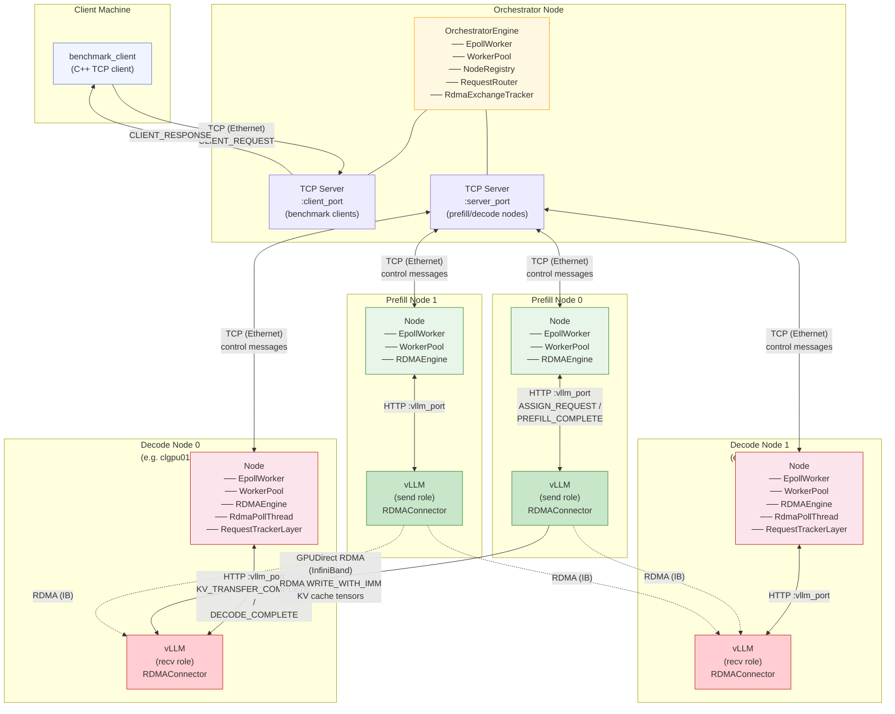
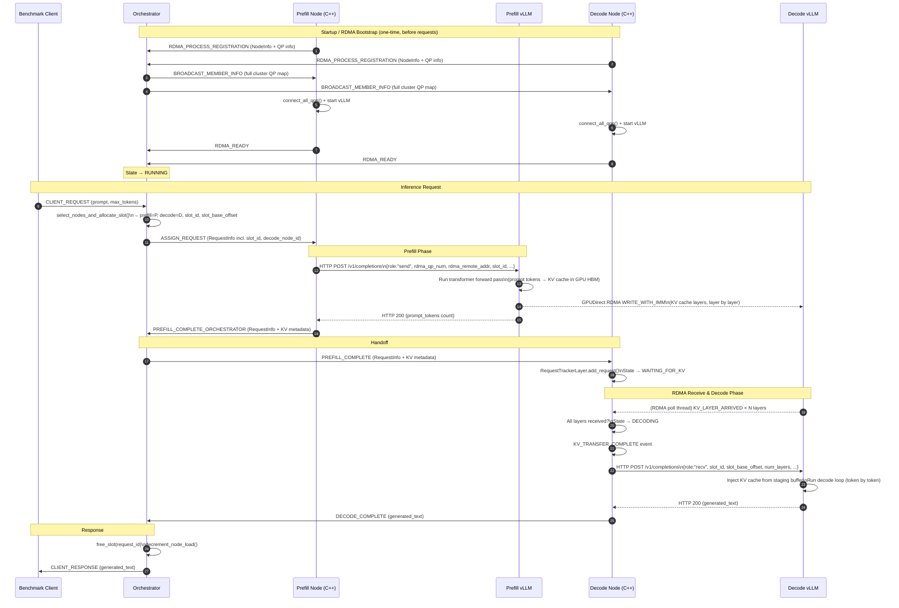

# Architecture Diagrams

## Deployment / Network Topology

The cluster is composed of three logical roles connected over two distinct networks: a regular TCP/IP Ethernet fabric (control plane) and a high-speed InfiniBand fabric (data plane).

**Network layers:**
| Layer | Protocol | Purpose |
|-------|----------|---------|
| Control plane | TCP / Ethernet | Node registration, request routing, status messages |
| Data plane | InfiniBand RDMA (`WRITE_WITH_IMM`) | KV cache tensor transfer (GPU-to-GPU, zero-copy) |

---

## Request Lifecycle (Sequence Diagram)

This diagram traces a single LLM inference request from the moment the benchmark client sends it until the generated text is returned.

**Key latency contributors** (from README performance numbers):
| Phase | Typical Duration |
|-------|-----------------|
| Orchestrator routing + slot allocation | < 1 ms |
| Prefill (vLLM forward pass) | 50–200 ms |
| RDMA KV cache transfer (GPUDirect) | 1–10 ms |
| Decode (vLLM token generation) | 500–2000 ms |
| **End-to-end** | **600–2200 ms** |
